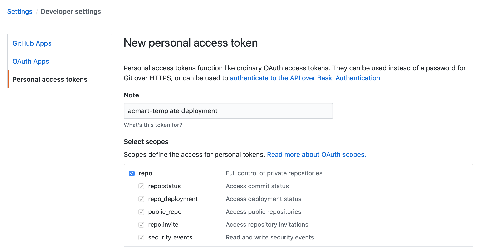
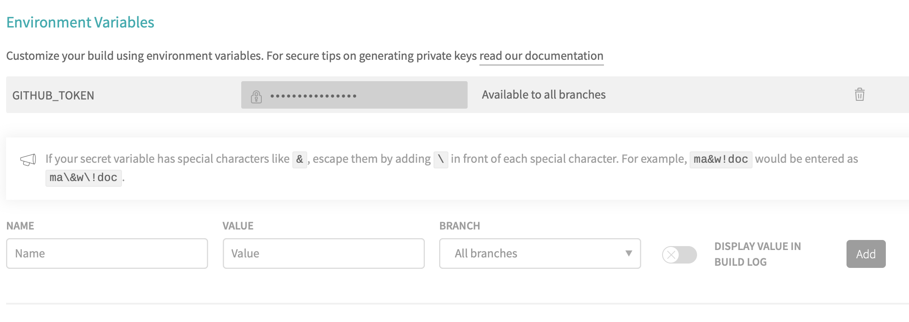
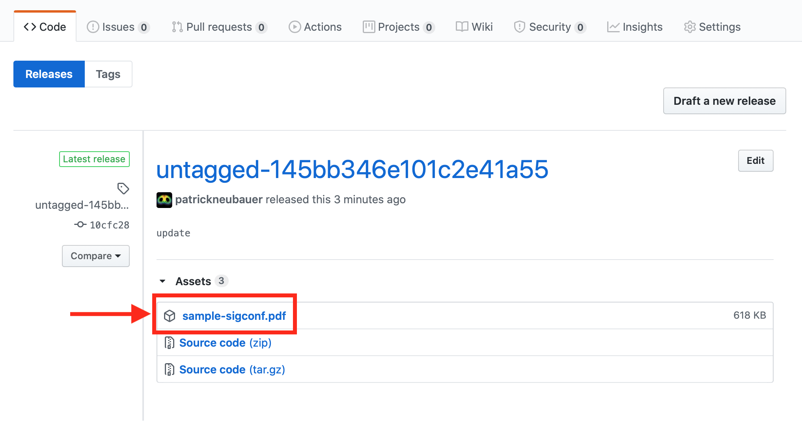

# 

# acmart-template

ACM Master Article Template with Travis Continuous Integration build

Original [ACM Master Article Template](https://www.acm.org/publications/proceedings-template) source retrieved from [https://www.acm.org/binaries/content/assets/publications/consolidated-tex-template/acmart-master.zip](https://www.acm.org/binaries/content/assets/publications/consolidated-tex-template/acmart-master.zip) (Version 1.71).

Commits pushed to this repository trigger an automated build process which result includes `sample-sigconf.pdf` and is produced as asset on at the [release page](https://github.com/patrickneubauer/acmart-template/releases/) of this repository. The latest release is available [here](https://github.com/patrickneubauer/acmart-template/releases/latest).  

To use this template, [create a new repository based on this template](https://help.github.com/en/github/creating-cloning-and-archiving-repositories/creating-a-repository-from-a-template) and add the environment variable `GITHUB_TOKEN` to your Travis repository settings with the value generated by [creating a new Github personal access token](https://github.com/settings/tokens/new).

Once a commit is pushed to the repository, a new build is triggered for your Travic CI repository located at https://travis-ci.org/github/GITHUB-USER/REPO.

